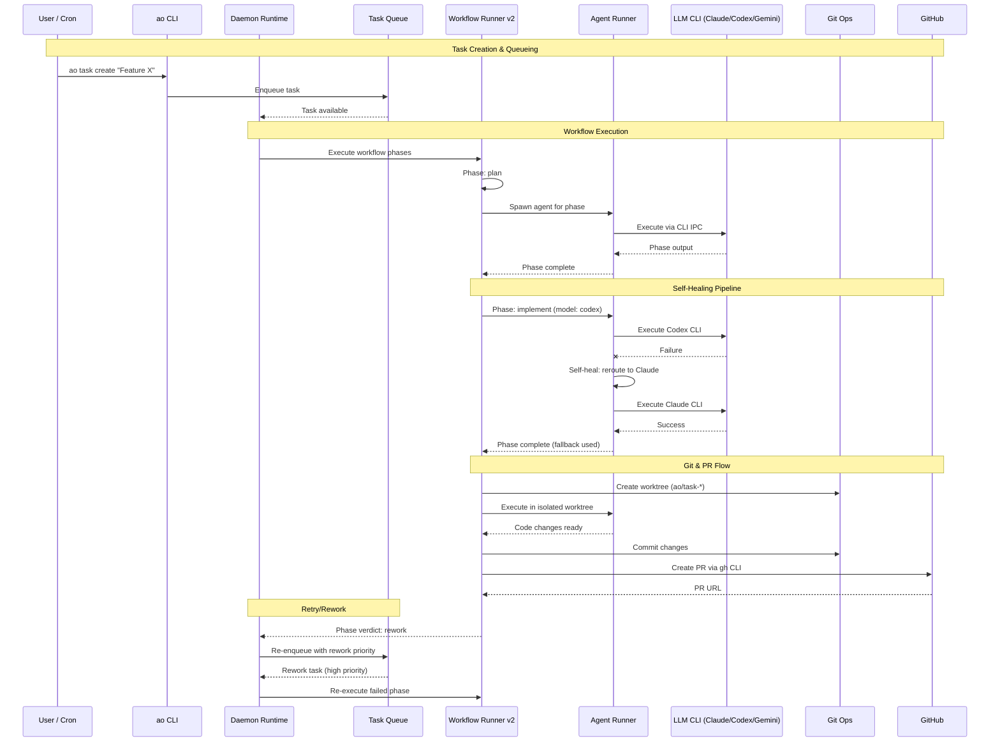

## Overview

How data flows through the AO CLI during task execution — from task creation through workflow phases, agent execution, and PR creation. Shows the daemon's queue-based scheduling and the self-healing model routing pipeline.

## Diagram

## Notes

- The daemon polls the queue continuously, executing tasks by priority: rework > rebase > review > new work
- Each workflow phase runs in an isolated git worktree to prevent conflicts between concurrent agents
- Agent-runner manages LLM CLI processes via IPC (stdin/stdout/stderr pipes)
- The self-healing pipeline tracks per-model success rates in .ao/state/
- oai-runner handles OpenAI-compatible streaming API calls as an alternative to CLI tools
- Workflow phases can emit verdicts: pass, fail, rework — rework re-enters the queue at high priority
