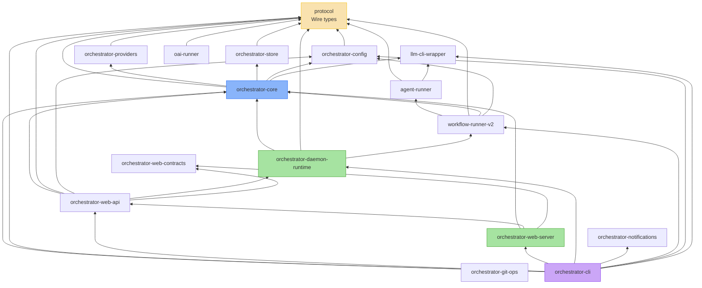

## Overview

Internal crate dependency graph for the ao-cli 16-crate Rust workspace. Derived from reading each crate's Cargo.toml. Shows how the protocol crate is the foundation, orchestrator-core provides domain logic, and higher-level crates compose the CLI, daemon, and web server.

## Diagram

## Notes

- `protocol` is the leaf crate — shared wire types with no internal deps
- `orchestrator-core` is the hub: domain logic, ServiceHub DI, depends on config, store, providers, llm-cli-wrapper
- `orchestrator-cli` is the root: depends on most other crates to compose the full binary
- `llm-cli-wrapper` is standalone (no internal deps); `oai-runner` depends only on protocol
- `oai-runner` uses rmcp (MCP client), tiktoken-rs (token counting), and OpenAI-compatible streaming APIs
- `workflow-runner-v2` composes agent-runner + core for multi-phase execution
- Default workspace members: orchestrator-cli, agent-runner, llm-cli-wrapper, oai-runner
- External deps: axum 0.8 (web), async-graphql 7 (API), croner 3 (scheduling), tokio (async), clap (CLI), serde (serialization)
