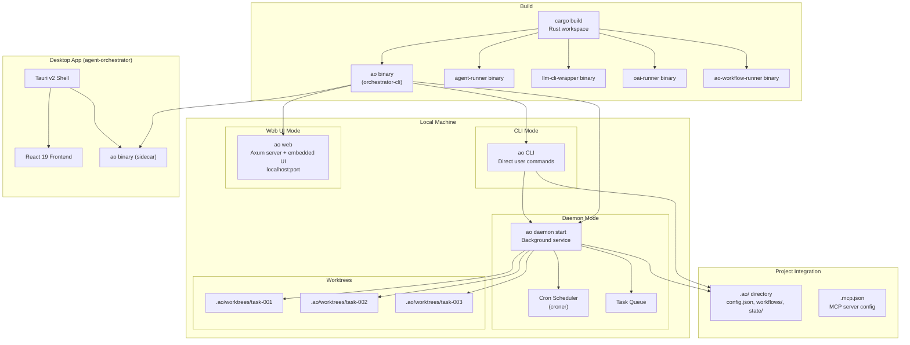

## Overview

How AO CLI is built, distributed, and deployed. The Rust binary runs locally as both a CLI and a background daemon. The desktop app embeds it as a Tauri sidecar. No cloud deployment — AO runs entirely on the developer's machine.

## Diagram

## Notes

- AO is a local-only tool — no cloud deployment, all state in .ao/ directory
- Five build targets: orchestrator-cli (ao), agent-runner, llm-cli-wrapper, oai-runner (ao-oai-runner), workflow-runner-v2 (ao-workflow-runner)
- The daemon runs as a background process, managing worktrees and executing workflows on schedule
- The Tauri desktop app builds ao-cli via `scripts/prepare-sidecar.mjs` and bundles it
- Each project configures AO via .ao/config.json and .ao/workflows/*.yaml
- MCP server connections configured in .mcp.json at the project root
- Git worktrees provide filesystem isolation for concurrent agent execution
