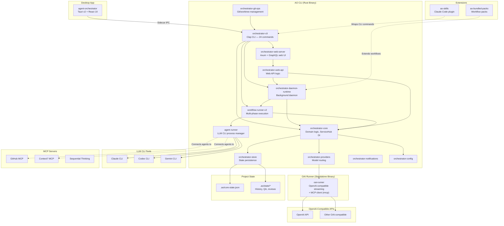

## Overview

High-level system architecture of the AO Agent Orchestrator ecosystem. The core is a 16-crate Rust workspace (ao-cli) that manages tasks, workflows, and concurrent AI agents. The desktop app (agent-orchestrator) wraps it as a Tauri sidecar. Skills and packs extend its capabilities.

## Diagram

## Notes

- The daemon runs background workflows with queue-based scheduling (croner for cron)
- Self-healing pipeline: failing model routes auto-fallback to Claude
- Workflow optimizer tracks per-model success rates and creates bugfix tasks on failures
- Git worktrees provide isolated execution environments for each agent
- The web UI is Axum-based with async-graphql API and embedded static assets
- oai-runner is a standalone binary for OpenAI-compatible streaming with MCP client support (rmcp)
- State persisted as JSON files in .ao/ directory (no external database)
