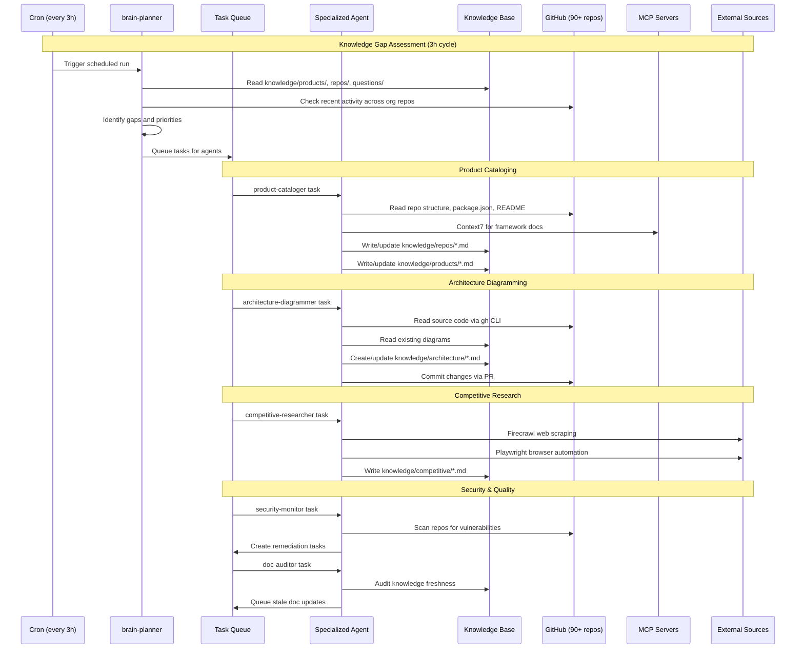

## Overview

How data flows through the brain's AI workforce — from scheduled planner runs that identify knowledge gaps, through task execution by specialized agents, to knowledge base updates and GitHub operations across the org.

## Diagram

## Notes

- The 3-hour planner cycle is the heartbeat — it continuously identifies gaps and queues work
- Agents read from GitHub (source of truth for code) and write to the knowledge base (this repo)
- MCP servers provide external capabilities: Context7 for docs, Firecrawl for web scraping
- The knowledge base is version-controlled in git — all changes go through PRs
- Feedback loop: planner reads knowledge → identifies gaps → queues agents → agents fill gaps → planner reads updated knowledge
- The stale-detector agent monitors knowledge freshness and flags outdated content
- All agent output is structured Markdown with YAML frontmatter for machine readability
