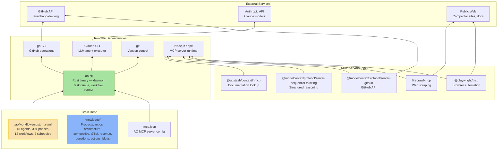

## Overview

Dependency graph for the brain repo — the org-wide AI workforce command center. The brain has no application code; its dependencies are the AO CLI runtime, MCP servers, and external services that agents connect to.

## Diagram

## Notes

- The brain has zero npm/cargo dependencies — it's pure YAML config and Markdown knowledge
- AO CLI (Rust binary) is the only hard runtime dependency
- All MCP servers are installed on-the-fly via npx — no local installation required
- Claude CLI is the agent executor — all 18 agents run through it
- gh CLI provides GitHub operations for agents that read/write across the org
- The brain depends on 5 MCP servers, each providing distinct capabilities to agents
- External service dependencies: Anthropic API (LLM), GitHub API (org data), public web (research)
