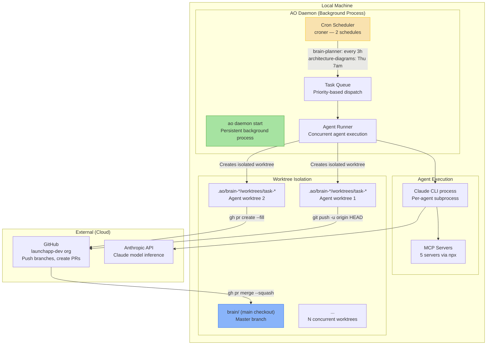

## Overview

Deployment architecture for the brain repo. The brain runs entirely on a local developer machine via the AO CLI daemon. There is no cloud deployment — agents execute locally, read/write to the knowledge base via git, and interact with external services through CLI tools and MCP servers.

## Diagram

## Notes

- Entirely local deployment — no cloud infrastructure, containers, or CI/CD pipelines
- AO daemon runs as a persistent background process (`ao daemon start`)
- Two scheduled workflows: brain-planner (every 3h) and architecture-diagrams (Thursdays 7am)
- Each agent task gets an isolated git worktree for safe parallel execution
- Workflow pipeline: agent writes to worktree → git push → gh pr create → gh pr merge --squash
- All changes to the brain repo flow through PRs for traceability
- MCP servers are ephemeral — launched per-agent via npx, no persistent server processes
- No build step, no compilation — the brain is just YAML config and Markdown
