## Overview

System architecture of the brain repo — the org-wide AI workforce command center. Runs on AO CLI with 22 specialized agents, 21 workflows, 35 phases, and MCP server integrations. Maintains the knowledge base, product catalog, and strategic planning for the entire launchapp-dev org.

## Diagram

```mermaid
graph TD
    subgraph "AO CLI Daemon"
        DAEMON["ao daemon<br/>Background scheduler"]
        QUEUE["Task Queue<br/>Priority-based"]
    end

    subgraph "Agents (22)"
        subgraph "Planning & Strategy"
            PLANNER["planner<br/>3h cron, knowledge gaps"]
            TRIAGER["triager"]
            STRATEGIST["gtm-strategist"]
            IDEATOR["product-ideator"]
            REVENUE["revenue-analyst"]
        end

        subgraph "Development"
            REVIEWER["reviewer"]
            TOOLMAKER["toolmaker"]
            ARCHITECT["architecture-diagrammer"]
            WFOPT["workflow-optimizer"]
        end

        subgraph "Quality & Security"
            AUDITOR["doc-auditor"]
            SDKAUDIT["sdk-auditor"]
            SECURITY["security-monitor"]
            STALE["stale-detector"]
        end

        subgraph "Research & Docs"
            COMPETITIVE["competitive-researcher"]
            CATALOGER["product-cataloger"]
            DOCWRITER["product-doc-writer"]
            CURATOR["knowledge-curator"]
            IMPACT["impact-analyzer"]
            RELEASE["release-coordinator"]
            QGEN["question-generator"]
            ACTEX["action-extractor"]
        end
    end

    subgraph "Knowledge Base"
        PRODUCTS["knowledge/products/<br/>7 product files"]
        REPOS["knowledge/repos/<br/>25+ repo docs"]
        ARCH["knowledge/architecture/<br/>Mermaid diagrams"]
        QUESTIONS["knowledge/questions/"]
        COMPETITIVE_KB["knowledge/competitive/"]
        GTM["knowledge/gtm/"]
        REVENUE_KB["knowledge/revenue/"]
        IDEAS["knowledge/ideas/"]
    end

    subgraph "MCP Servers"
        CTX7["Context7<br/>Documentation lookup"]
        SEQTHINK["Sequential Thinking<br/>Structured reasoning"]
        GITHUB["GitHub MCP<br/>Repo operations"]
        FIRECRAWL["Firecrawl<br/>Web scraping"]
        PLAYWRIGHT["Playwright<br/>Browser automation"]
    end

    subgraph "GitHub Org"
        ORGGH["launchapp-dev<br/>90+ repos"]
    end

    DAEMON --> QUEUE
    QUEUE --> PLANNER
    QUEUE --> TRIAGER
    QUEUE --> REVIEWER
    QUEUE --> AUDITOR
    QUEUE --> SECURITY
    QUEUE --> CATALOGER

    PLANNER -->|Assesses gaps, queues tasks| QUEUE
    CURATOR --> PRODUCTS
    CURATOR --> REPOS
    ARCHITECT --> ARCH
    CATALOGER --> PRODUCTS
    COMPETITIVE --> COMPETITIVE_KB
    STRATEGIST --> GTM
    REVENUE --> REVENUE_KB
    IDEATOR --> IDEAS

    PLANNER --> CTX7
    PLANNER --> SEQTHINK
    REVIEWER --> GITHUB
    COMPETITIVE --> FIRECRAWL
    COMPETITIVE --> PLAYWRIGHT
    CATALOGER --> GITHUB
    ARCHITECT --> GITHUB

    GITHUB --> ORGGH
```

## Notes

- The brain-planner agent runs every 3 hours via cron; architecture-diagrammer runs weekly (Thursdays 7am)
- 22 agents cover the full product lifecycle: planning, development, security, docs, GTM, revenue
- Knowledge base organized by domain: products, repos, architecture, competitive, gtm, revenue, ideas
- MCP servers provide external capabilities: Context7 for docs, Firecrawl for web scraping, GitHub for repo ops
- The brain repo itself has no application code — it's pure configuration, knowledge, and agent definitions
- Tools directory contains custom scripts for agents
- All state managed by AO CLI in .ao/ directory
