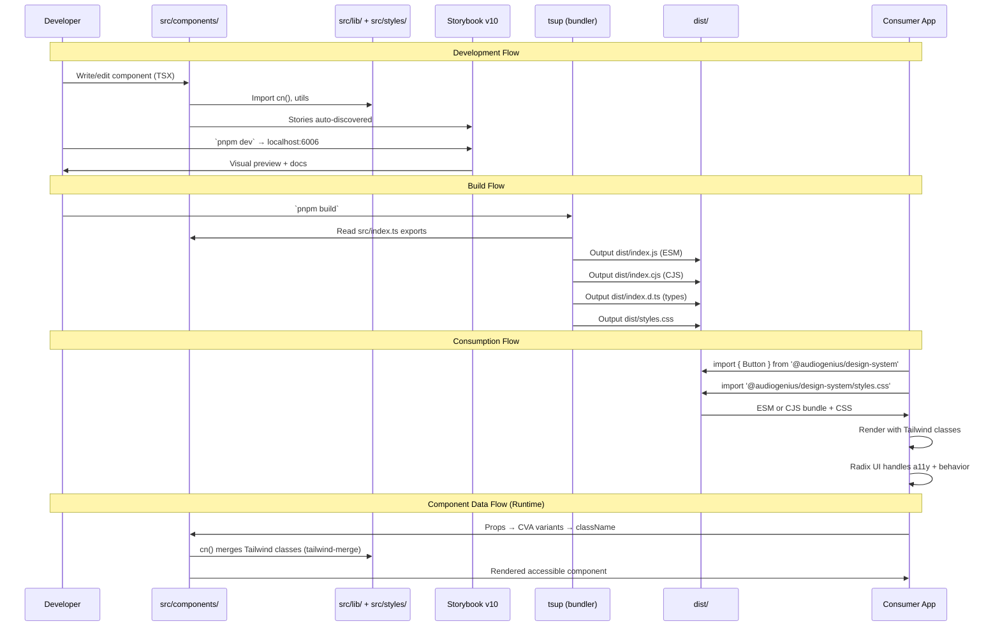

## Overview

How data flows through the design system — from component source code through the build pipeline to consuming applications. Covers the development workflow (Storybook), build output (tsup), and how consumers import and render components.

## Diagram

## Notes

- Two output formats: ESM (dist/index.js) for modern bundlers, CJS (dist/index.cjs) for legacy
- CSS is distributed separately via `dist/styles.css` — consumers must import it
- Components use CVA (class-variance-authority) for variant-based styling at the prop level
- tailwind-merge (via cn() utility) resolves conflicting Tailwind classes at runtime
- Radix UI primitives handle keyboard navigation, focus management, ARIA attributes
- Storybook v10 serves as both the development environment and component documentation
- Form components integrate react-hook-form + zod for validation data flow
- Chart components (recharts) accept data arrays and render via SVG
- DataTable (tanstack/react-table) handles sorting, filtering, pagination internally
