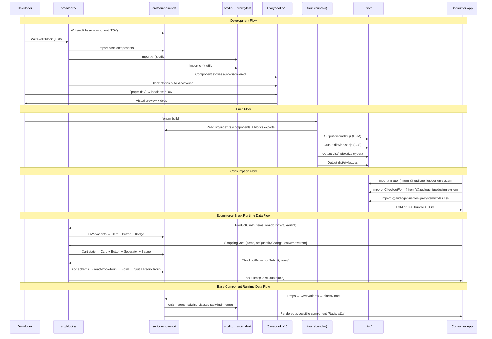

## Overview

How data flows through the design system — from component source code through the build pipeline to consuming applications. Covers both the base component layer and the blocks layer (including new ecommerce blocks), the development workflow (Storybook), build output (tsup), and runtime data patterns.

## Diagram

## Notes

- Two-tier export: src/index.ts re-exports both base components and all block categories
- Blocks are composed patterns that wire base components together with business logic
- Ecommerce data flow: ProductCard renders product data with variant layouts (compact/detailed/horizontal); ShoppingCart manages cart items with quantity controls and price calculations; CheckoutForm collects shipping/payment info via multi-field zod-validated form
- CheckoutForm uses react-hook-form + zod for form state management and validation — props flow in, CheckoutValues flow out via onSubmit callback
- Two output formats: ESM (dist/index.js) for modern bundlers, CJS (dist/index.cjs) for legacy
- CSS is distributed separately via `dist/styles.css` — consumers must import it
- CVA handles variant-based styling at both the component and block level (e.g., productCardVariants)
- tailwind-merge (via cn() utility) resolves conflicting Tailwind classes at runtime
- Radix UI primitives handle keyboard navigation, focus management, ARIA attributes
- Storybook v10 serves as both the development environment and component documentation — blocks include their own stories
- Chart components (recharts) accept data arrays and render via SVG
- DataTable (tanstack/react-table) handles sorting, filtering, pagination internally
