## Overview

External dependency graph for the @audiogenius/design-system package. Shows the relationship between Radix UI primitives, styling utilities, data visualization libraries, and form handling packages.

## Diagram

```mermaid
graph BT
    DS["@audiogenius/design-system"]

    subgraph "Radix UI Primitives (28 packages)"
        R1["@radix-ui/react-dialog"]
        R2["@radix-ui/react-dropdown-menu"]
        R3["@radix-ui/react-select"]
        R4["@radix-ui/react-tabs"]
        R5["@radix-ui/react-tooltip"]
        R6["@radix-ui/react-popover"]
        R7["@radix-ui/react-checkbox"]
        RMORE["... +20 more @radix-ui/*"]
    end

    subgraph "Styling"
        CVA["class-variance-authority"]
        TM["tailwind-merge"]
        CLSX["clsx"]
        TWCSS["tailwindcss 3"]
    end

    subgraph "Data & Visualization"
        RECHARTS["recharts"]
        TANSTACK["@tanstack/react-table"]
        DFN["date-fns"]
        RDP["react-day-picker"]
    end

    subgraph "Forms"
        RHF["react-hook-form"]
        RESOLVERS["@hookform/resolvers"]
        ZOD["zod"]
    end

    subgraph "UI Utilities"
        CMDK["cmdk (Command palette)"]
        SONNER["sonner (Toasts)"]
        PANELS["react-resizable-panels"]
    end

    subgraph "Peer Dependencies"
        REACT["react ^18 || ^19"]
        RDOM["react-dom ^18 || ^19"]
    end

    DS --> R1
    DS --> R2
    DS --> R3
    DS --> R4
    DS --> R5
    DS --> R6
    DS --> R7
    DS --> RMORE
    DS --> CVA
    DS --> TM
    DS --> CLSX
    DS --> RECHARTS
    DS --> TANSTACK
    DS --> DFN
    DS --> RDP
    DS --> RHF
    DS --> RESOLVERS
    DS --> ZOD
    DS --> CMDK
    DS --> SONNER
    DS --> PANELS
    DS -.->|peer| REACT
    DS -.->|peer| RDOM

    style DS fill:#cba6f7,stroke:#8839ef
    style TWCSS fill:#f9e2af,stroke:#f5c211
```

## Notes

- 28 @radix-ui/* packages provide accessible, unstyled primitives
- CVA + tailwind-merge + clsx form the styling utility chain
- recharts powers the Chart component; @tanstack/react-table powers DataTable
- react-day-picker + date-fns power the Calendar and DatePicker components
- react-hook-form + zod handle form validation (via @hookform/resolvers)
- cmdk provides the Command/Combobox palette component
- sonner provides the toast notification system
- Tailwind CSS 3 (not 4) is used in the design system itself
