## Overview

Internal module dependency graph and external package dependencies for the @audiogenius/design-system. Shows the two-tier architecture: blocks depend on base components, which depend on Radix UI primitives and utility libraries.

## Diagram

```mermaid
graph BT
    subgraph "Blocks Layer (src/blocks/)"
        BAUTH["blocks/auth<br/>LoginForm, SignUpForm,<br/>ForgotPasswordForm, OTPVerification"]
        BNAV["blocks/navigation<br/>AppSidebar, TopNav,<br/>MobileNavDrawer"]
        BSETTINGS["blocks/settings<br/>ProfileSettings, AccountSettings,<br/>NotificationPreferences, BillingPage"]
        BMARKETING["blocks/marketing<br/>HeroSection, FeatureGrid,<br/>PricingTable, TestimonialCarousel"]
        BDASH["blocks/dashboard<br/>StatsOverview, ActivityFeed,<br/>MetricCards"]
        BDATA["blocks/data<br/>FullDataTable, KanbanBoard"]
        BECOM["blocks/ecommerce<br/>ProductCard, ShoppingCart,<br/>CheckoutForm"]
    end

    subgraph "Base Components (src/components/)"
        COMP["52 base components<br/>Button, Card, Input, Form,<br/>Badge, Separator, RadioGroup,<br/>Select, Dialog, Table, ..."]
    end

    LIB["src/lib/utils<br/>cn() helper"]

    subgraph "Radix UI Primitives (28 packages)"
        R1["@radix-ui/react-dialog"]
        R2["@radix-ui/react-dropdown-menu"]
        R3["@radix-ui/react-select"]
        R4["@radix-ui/react-tabs"]
        R5["@radix-ui/react-tooltip"]
        R6["@radix-ui/react-popover"]
        R7["@radix-ui/react-checkbox"]
        RMORE["... +20 more @radix-ui/*"]
    end

    subgraph "Styling"
        CVA["class-variance-authority"]
        TM["tailwind-merge"]
        CLSX["clsx"]
        TWCSS["tailwindcss 3"]
    end

    subgraph "Data & Visualization"
        RECHARTS["recharts"]
        TANSTACK["@tanstack/react-table"]
        DFN["date-fns"]
        RDP["react-day-picker"]
    end

    subgraph "Forms"
        RHF["react-hook-form"]
        RESOLVERS["@hookform/resolvers"]
        ZOD["zod"]
    end

    subgraph "DnD"
        DNDCORE["@dnd-kit/core"]
        DNDSORT["@dnd-kit/sortable"]
        DNDUTIL["@dnd-kit/utilities"]
    end

    subgraph "UI Utilities"
        CMDK["cmdk (Command palette)"]
        SONNER["sonner (Toasts)"]
        PANELS["react-resizable-panels"]
    end

    subgraph "Peer Dependencies"
        REACT["react ^18 || ^19"]
        RDOM["react-dom ^18 || ^19"]
    end

    BECOM -->|"Card, Button, Badge,<br/>Separator, Form, Input,<br/>RadioGroup"| COMP
    BAUTH -->|"Form, Input, Button,<br/>Card, Label"| COMP
    BDASH -->|"Card, Chart,<br/>KPICard"| COMP
    BDATA -->|"Table, DataTable,<br/>Button, Badge"| COMP
    BMARKETING -->|"Button, Card,<br/>Badge"| COMP
    BNAV -->|"Button, Sheet,<br/>NavigationMenu"| COMP
    BSETTINGS -->|"Form, Input, Card,<br/>Switch, Select"| COMP

    BECOM --> LIB
    BECOM -->|"CheckoutForm"| RHF
    BECOM -->|"CheckoutForm"| ZOD
    BECOM -->|"ProductCard"| CVA
    BAUTH --> RHF
    BAUTH --> ZOD
    BDATA --> DNDCORE
    BDATA --> DNDSORT

    COMP --> R1
    COMP --> R2
    COMP --> R3
    COMP --> R4
    COMP --> R5
    COMP --> R6
    COMP --> R7
    COMP --> RMORE
    COMP --> CVA
    COMP --> TM
    COMP --> CLSX
    COMP --> RECHARTS
    COMP --> TANSTACK
    COMP --> DFN
    COMP --> RDP
    COMP --> RHF
    COMP --> RESOLVERS
    COMP --> ZOD
    COMP --> CMDK
    COMP --> SONNER
    COMP --> PANELS
    LIB --> TM
    LIB --> CLSX
    COMP -.->|peer| REACT
    COMP -.->|peer| RDOM

    style BECOM fill:#a6e3a1,stroke:#40a02b
    style COMP fill:#cba6f7,stroke:#8839ef
    style TWCSS fill:#f9e2af,stroke:#f5c211
```

## Notes

- Two-tier internal dependency: blocks compose base components, base components wrap Radix UI primitives
- Ecommerce blocks depend on: Card, Button, Badge, Separator (ShoppingCart, ProductCard); Form, Input, RadioGroup, Label + react-hook-form + zod (CheckoutForm); CVA for ProductCard variants
- @dnd-kit packages (core, sortable, utilities) added for KanbanBoard drag-and-drop
- 28 @radix-ui/* packages provide accessible, unstyled primitives
- CVA + tailwind-merge + clsx form the styling utility chain
- recharts powers the Chart component; @tanstack/react-table powers DataTable
- react-day-picker + date-fns power the Calendar and DatePicker components
- react-hook-form + zod handle form validation — used by both base Form component and blocks (auth, ecommerce)
- cmdk provides the Command/Combobox palette component
- sonner provides the toast notification system
- Tailwind CSS 3 (not 4) is used in the design system itself
