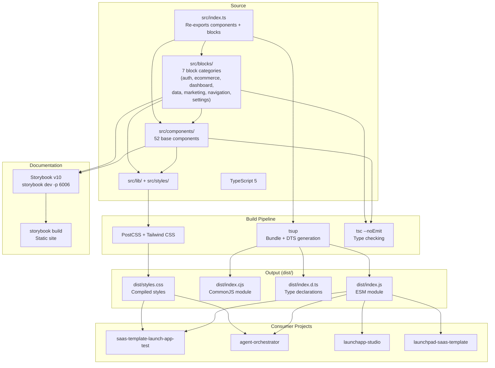

## Overview

How the design system is built, documented, and distributed. Built with tsup into dual ESM/CJS bundles, documented via Storybook v10, and consumed as a package by other org repos. The source tree includes both base components and composed blocks (auth, ecommerce, dashboard, etc.), all bundled into a single package export.

## Diagram

## Notes

- Single entry point (src/index.ts) re-exports both base components and all block categories into one bundle
- tsup bundles to both ESM and CJS for maximum compatibility
- Package exports: "." for JS/types, "./styles.css" for compiled CSS — no separate block entry point
- Blocks are tree-shakeable: consumers only pay for the blocks they import
- Storybook v10 with @storybook/react-vite for Vite-based dev server — serves both component and block stories
- Private package (not published to npm) — consumed via workspace references or git
- The @audiogenius/design-system namespace is used across the org
- Consumers import components and blocks from the same package, separately import styles.css
