## Overview

System architecture of the @audiogenius/design-system — a Radix UI-based React component library with 52 components, built with CVA + Tailwind CSS, documented via Storybook v10, and bundled with tsup.

## Diagram

```mermaid
graph TD
    subgraph "Design System Package"
        subgraph "src/components/ (52 components)"
            FOUND["Foundation<br/>Button, Input, Label,<br/>Badge, Separator, Skeleton,<br/>VisuallyHidden"]
            LAYOUT["Layout<br/>Card, AspectRatio,<br/>Resizable, ScrollArea"]
            OVERLAY["Overlays<br/>Dialog, Sheet, AlertDialog,<br/>Popover, Tooltip, DropdownMenu,<br/>FocusScope, Portal"]
            NAV["Navigation<br/>NavigationMenu, Menubar,<br/>Breadcrumb, Tabs, Toolbar,<br/>Pagination"]
            FORM["Forms<br/>Checkbox, RadioGroup, Select,<br/>Switch, Slider, Textarea,<br/>Combobox, MultiSelect, Form"]
            DATA["Data Display<br/>Table, DataTable, Chart,<br/>KPICard, StatDisplay,<br/>Calendar, DatePicker"]
            FEED["Feedback<br/>Alert, Toast, Sonner,<br/>Progress, Accordion"]
        end

        subgraph "src/blocks/ (composed page blocks)"
            BAUTH["Auth<br/>LoginForm, SignUpForm,<br/>ForgotPasswordForm, OTPVerification"]
            BNAV["Navigation<br/>AppSidebar, TopNav,<br/>MobileNavDrawer"]
            BSET["Settings<br/>ProfileSettings, AccountSettings,<br/>NotificationPreferences, BillingPage"]
            BMKT["Marketing<br/>HeroSection, FeatureGrid,<br/>PricingTable, TestimonialCarousel"]
            BDASH["Dashboard<br/>StatsOverview, ActivityFeed,<br/>MetricCards"]
            BDATA["Data<br/>FullDataTable, KanbanBoard"]
            BECOM["Ecommerce ✦ new<br/>ProductCard, ProductCardGrid,<br/>ShoppingCart, CheckoutForm"]
        end

        LIB["src/lib/<br/>Utility functions"]
        STYLES["src/styles/<br/>CSS + Tailwind config"]
        INDEX["src/index.ts<br/>Public exports"]
    end

    subgraph "Build Tooling"
        TSUP["tsup<br/>ESM + CJS bundle"]
        TAILWIND["Tailwind CSS 3<br/>+ PostCSS"]
        TS["TypeScript 5"]
    end

    subgraph "Documentation"
        SB["Storybook v10<br/>Component playground"]
    end

    subgraph "Primitives"
        RADIX["Radix UI<br/>28 @radix-ui/* packages"]
        CVA["class-variance-authority<br/>Variant styling"]
        TM["tailwind-merge<br/>Class merging"]
    end

    subgraph "Consumers"
        SAAS["saas-template<br/>(via @repo/ui-kit)"]
        AOAPP["agent-orchestrator<br/>(Tauri desktop)"]
        STUDIO["launchapp-studio<br/>(IDE)"]
        TEMPLATES["launchpad-saas-template"]
    end

    FOUND --> RADIX
    OVERLAY --> RADIX
    NAV --> RADIX
    FORM --> RADIX
    FOUND --> CVA
    FOUND --> TM
    LIB --> TM

    BAUTH --> FORM
    BAUTH --> FOUND
    BNAV --> NAV
    BNAV --> FOUND
    BSET --> FORM
    BSET --> DATA
    BMKT --> FOUND
    BMKT --> LAYOUT
    BDASH --> DATA
    BDASH --> FOUND
    BDATA --> DATA
    BDATA --> FOUND
    BECOM --> FORM
    BECOM --> FOUND
    BECOM --> LAYOUT

    INDEX --> TSUP
    STYLES --> TAILWIND
    TSUP -->|dist/index.js + .cjs| SAAS
    TSUP -->|dist/index.js + .cjs| AOAPP
    TSUP -->|dist/index.js + .cjs| STUDIO
    TSUP -->|dist/index.js + .cjs| TEMPLATES
```

## Notes

- 52 atomic components spanning foundation, layout, overlays, navigation, forms, data display, and feedback
- 7 block modules (auth, navigation, settings, marketing, dashboard, data, ecommerce) — page-ready compositions that build on the atomic components
- Ecommerce block module added 2026-03-19: `ProductCard` (CVA variants: compact/detailed/horizontal), `ProductCardGrid`, `ShoppingCart` (tax + shipping calc), `CheckoutForm` (react-hook-form + zod, card/PayPal payment)
- Built on 28 @radix-ui/* primitive packages for accessibility and behavior
- CVA (class-variance-authority) handles component variant styling
- Dual ESM/CJS output via tsup for maximum compatibility
- Storybook v10 for component documentation and visual testing
- Peer dependency on React 18 or 19
- Additional data viz: recharts for Chart component, @tanstack/react-table for DataTable
- Form integration: react-hook-form + @hookform/resolvers + zod for validation
