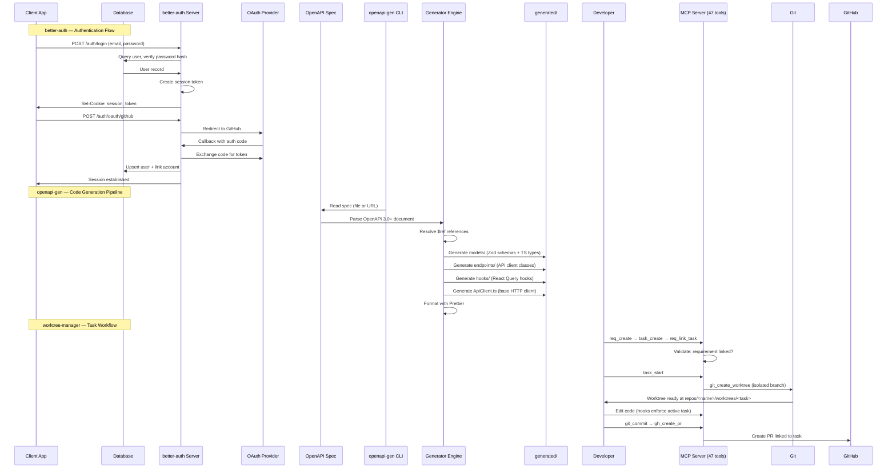

## Overview

Data flows through each of the four developer tools: better-auth's authentication flow, launchapp-studio's IDE data pipeline, worktree-manager's task-driven workflow, and openapi-gen's code generation pipeline.

## Diagram

## Notes

- **better-auth**: Supports sessions, OAuth, 2FA, magic links; framework-agnostic via adapters
- **openapi-gen**: One-way pipeline (spec → code); no runtime component; generates Zod for validation
- **worktree-manager**: Enforces task-first workflow via Claude Code hooks; blocks code edits without active task
- **launchapp-studio**: IDE data flow is file system → Monaco editor → user edits → file write-back; AI chat streams via Claude CLI
- better-auth's plugin system allows extending the flow (e.g., Stripe plugin adds billing hooks after auth)
- openapi-gen supports both local file and URL specs; output is grouped by OpenAPI tags
- worktree-manager's MCP server provides 47 tools across 4 modules (git, github, tasks, requirements)
