## Overview

Dependency graph showing both internal dependencies (between the four tools and other org products) and key external dependencies for each tool.

## Diagram

```mermaid
graph BT
    subgraph "better-auth"
        BA["better-auth<br/>v0.0.2-beta.8"]
        BA_CLI["@better-auth/cli"]
        BA_EXPO["@better-auth/expo"]
        BA_STRIPE["@better-auth/stripe"]
    end

    subgraph "launchapp-studio"
        STUDIO["code-pilot-studio<br/>v0.1.0"]
    end

    subgraph "worktree-manager"
        WM["worktree-manager<br/>v1.0.0"]
    end

    subgraph "openapi-gen"
        OG["openapi-gen<br/>v0.0.5"]
    end

    subgraph "Org Products (Consumers)"
        SAAS["saas-template"]
        LPAD["launchpad-baas"]
        LITE["launchapp-lite"]
        LITE2["launchapp-lite-v2"]
    end

    subgraph "External Dependencies"
        subgraph "better-auth deps"
            BIOME["Biome"]
            TURBO["Turborepo"]
        end
        subgraph "launchapp-studio deps"
            TAURI["Tauri v2"]
            REACT19["React 19"]
            MONACO["Monaco Editor"]
            XTERM["xterm.js"]
            ZUSTAND["Zustand"]
            VITE["Vite"]
        end
        subgraph "worktree-manager deps"
            NODEJS["Node.js"]
            CLAUDE_CODE["Claude Code (MCP host)"]
        end
        subgraph "openapi-gen deps"
            SWAGGER["@apidevtools/swagger-parser"]
            ZOD["Zod"]
            TANSTACK["@tanstack/react-query"]
            COMMANDER["Commander"]
            PRETTIER["Prettier"]
        end
    end

    BA_CLI --> BA
    BA_EXPO --> BA
    BA_STRIPE --> BA

    SAAS -.->|auth dependency| BA
    LPAD -.->|auth dependency| BA
    LITE -.->|auth dependency| BA
    LITE2 -.->|auth dependency| BA

    BA --> BIOME
    BA --> TURBO

    STUDIO --> TAURI
    STUDIO --> REACT19
    STUDIO --> MONACO
    STUDIO --> XTERM
    STUDIO --> ZUSTAND
    STUDIO --> VITE

    WM --> NODEJS
    WM --> CLAUDE_CODE

    OG --> SWAGGER
    OG --> ZOD
    OG --> TANSTACK
    OG --> COMMANDER
    OG --> PRETTIER

    style BA fill:#a6e3a1,stroke:#40a02b
    style STUDIO fill:#89b4fa,stroke:#1e66f5
    style WM fill:#f9e2af,stroke:#f5c211
    style OG fill:#f5c2e7,stroke:#ea76cb
```

## Notes

- **better-auth** is the most depended-upon tool — 4 org products use it as their auth layer
- All four tools are independent — no dependencies between them
- **launchapp-studio** has the heaviest external dependency footprint (Tauri, React, Monaco, xterm.js, etc.)
- **worktree-manager** is lightweight — just Node.js and Claude Code as MCP host
- **openapi-gen** depends on swagger-parser for spec parsing, Zod + React Query for generated output
- better-auth uses the same monorepo tooling as the rest of the org (pnpm + Turborepo + Biome)
- launchapp-studio shares Tauri v2 dependency with agent-orchestrator desktop app
- No circular dependencies exist in the developer tools ecosystem
