## Overview

Deployment architecture for each developer tool. better-auth publishes to npm; launchapp-studio builds native desktop binaries via Tauri; worktree-manager is cloned and run locally; openapi-gen publishes to npm as a CLI tool.

## Diagram

```mermaid
graph TD
    subgraph "better-auth Deployment"
        BA_SRC["GitHub: launchapp-dev/better-auth<br/>Public repo"]
        BA_BUILD["Turborepo build<br/>pnpm -r publish"]
        BA_NPM["npm Registry<br/>better-auth<br/>@better-auth/cli<br/>@better-auth/expo<br/>@better-auth/stripe"]
        BA_USER["Developer<br/>npm install better-auth"]

        BA_SRC --> BA_BUILD
        BA_BUILD -->|"bumpp version + publish"| BA_NPM
        BA_NPM --> BA_USER
    end

    subgraph "launchapp-studio Deployment"
        LS_SRC["GitHub: launchapp-dev/launchapp-studio<br/>Public repo"]
        LS_BUILD["Tauri v2 build<br/>pnpm tauri build"]
        LS_BIN["Native binaries<br/>macOS .dmg / Windows .msi / Linux .AppImage"]
        LS_USER["Developer<br/>Download + install desktop app"]

        LS_SRC --> LS_BUILD
        LS_BUILD --> LS_BIN
        LS_BIN --> LS_USER
    end

    subgraph "worktree-manager Deployment"
        WM_SRC["GitHub: launchapp-dev/worktree-manager<br/>Public repo"]
        WM_CLONE["git clone + configure<br/>Add to .mcp.json"]
        WM_USER["Developer<br/>Claude Code MCP server"]

        WM_SRC --> WM_CLONE
        WM_CLONE --> WM_USER
    end

    subgraph "openapi-gen Deployment"
        OG_SRC["GitHub: launchapp-dev/openapi-gen<br/>Public repo"]
        OG_BUILD["tsc build"]
        OG_NPM["npm Registry<br/>openapi-gen"]
        OG_USER["Developer<br/>npx openapi-gen generate"]

        OG_SRC --> OG_BUILD
        OG_BUILD --> OG_NPM
        OG_NPM --> OG_USER
    end

    style BA_NPM fill:#a6e3a1,stroke:#40a02b
    style LS_BIN fill:#89b4fa,stroke:#1e66f5
    style WM_CLONE fill:#f9e2af,stroke:#f5c211
    style OG_NPM fill:#f5c2e7,stroke:#ea76cb
```

## Notes

- **better-auth**: Published to npm via `bumpp` (version bump) + `pnpm -r publish --access public`; canary and next tags available
- **launchapp-studio**: Tauri builds native desktop apps; no published releases yet (Phase 3 in progress)
- **worktree-manager**: No package manager distribution — cloned directly from GitHub and configured as MCP server
- **openapi-gen**: Published to npm as a CLI tool (`npx openapi-gen`); v0.0.5 on npm
- All four tools are public GitHub repos
- better-auth is the only tool with a mature release pipeline (bumpp + Turborepo + npm publish)
- No CI/CD pipelines visible for launchapp-studio or worktree-manager
- openapi-gen has a `prepublishOnly` script that runs build + tests before publishing
- better-auth uses `simple-git-hooks` for pre-commit checks
