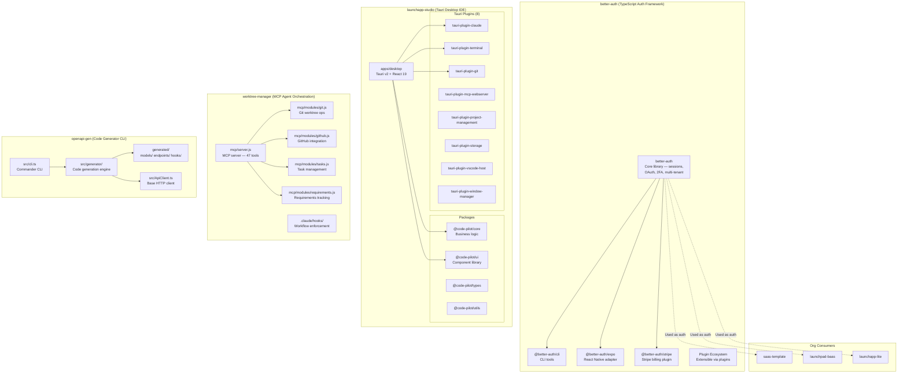

## Overview

System architecture of the Developer Tools product line — four independent tools: better-auth (TypeScript auth framework), launchapp-studio (Tauri desktop IDE), worktree-manager (MCP-based agent orchestration), and openapi-gen (OpenAPI code generator). Each serves a different purpose but several are consumed by or relate to other org products.

## Diagram

## Notes

- **better-auth**: Flagship open-source contribution; monorepo with 4 packages (core, cli, expo, stripe)
- **launchapp-studio**: Tauri v2 desktop app with 8 custom plugins; Phase 3 in progress (terminal, git, AI chat)
- **worktree-manager**: Predecessor to ao-cli; simpler Node.js MCP server with 47 tools for Claude Code
- **openapi-gen**: Standalone CLI that generates Zod schemas + React Query hooks from OpenAPI specs
- better-auth is the most impactful tool — it's the auth backbone for 3+ org products
- launchapp-studio shares architecture patterns with agent-orchestrator (both Tauri v2 apps)
- worktree-manager is stable at v1.0.0 but effectively superseded by ao-cli for active development
- openapi-gen is early-stage (v0.0.5) and maintenance-mode
