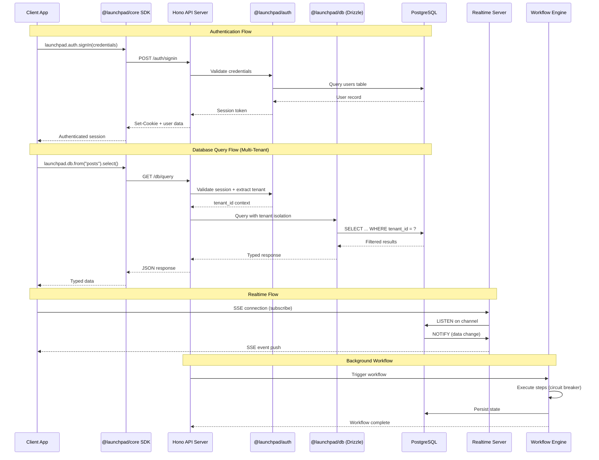

## Overview

How data flows through the Launchpad BaaS platform — from client SDK calls through the Hono API, authentication, database operations, and external service integrations. Shows the multi-tenant data isolation model.

## Diagram

## Notes

- Multi-tenancy enforced at the DB query layer — tenant_id is injected from auth context
- The realtime server uses PostgreSQL LISTEN/NOTIFY + Redis pub/sub + SSE for live updates
- Background workflows have circuit breaker patterns for resilience
- The SDK provides React hooks (via TanStack Query) for data fetching with automatic caching
- All SDK packages depend on @launchpad/core for HTTP client and session management
- The admin UI (Next.js) has its own API routes but shares the same DB layer
