## Overview

Package dependency graph for the Launchpad BaaS monorepo showing how SDKs, apps, and internal packages relate. Core SDK is the foundation, with auth and db building on top, and the API server consuming everything.

## Diagram

```mermaid
graph BT
    subgraph "Foundation"
        CORE["sdk/core<br/>@launchpad/core<br/>HTTP client, sessions"]
        ERRORS["packages/errors"]
        LOGGER["packages/logger"]
    end

    subgraph "Data Layer"
        DB["sdk/db<br/>@launchpad/db<br/>Drizzle ORM"]
        DBENGINE["launchpad-db-engine<br/>(external repo)"]
    end

    subgraph "Auth Layer"
        AUTH["sdk/auth<br/>@launchpad/auth<br/>better-auth"]
    end

    subgraph "Service Packages"
        PAY["sdk/payments<br/>@launchpad/payments"]
        STORAGE["packages/storage"]
        EMAIL["packages/email"]
        AI["packages/ai"]
        WORKFLOWS["packages/workflows"]
        SECRETS["packages/secrets"]
        SCHEDULER["packages/scheduler"]
        FUNCTIONS["packages/functions"]
    end

    subgraph "Observability"
        METRICS["packages/metrics"]
        TELEMETRY["packages/telemetry"]
        ALERTING["packages/alerting"]
    end

    subgraph "Platform"
        RESILIENCE["packages/resilience"]
        CHAOS["packages/chaos"]
        SECURITY["packages/security-scanner"]
        BACKUP["packages/backup"]
        EDGE["packages/edge-functions-runtime"]
        SDKGEN["packages/sdk-generator"]
    end

    subgraph "Apps"
        API["apps/api<br/>Hono server"]
        ADMIN["apps/admin<br/>Next.js"]
    end

    DB --> CORE
    AUTH --> CORE
    AUTH --> DB
    PAY --> CORE

    STORAGE --> CORE
    EMAIL --> CORE
    AI --> CORE
    WORKFLOWS --> CORE
    SECRETS --> CORE

    METRICS --> LOGGER
    TELEMETRY --> LOGGER
    ALERTING --> METRICS

    API --> CORE
    API --> AUTH
    API --> DB
    API --> PAY
    API --> STORAGE
    API --> EMAIL

    ADMIN --> AUTH
    ADMIN --> DB

    style CORE fill:#f9e2af,stroke:#f5c211
    style API fill:#cba6f7,stroke:#8839ef
    style ADMIN fill:#cba6f7,stroke:#8839ef
    style AUTH fill:#89b4fa,stroke:#1e66f5
    style DB fill:#89b4fa,stroke:#1e66f5
```

## Notes

- sdk/core is the leaf dependency — HTTP client, session management, React integration
- Auth depends on both core and db (needs user storage)
- All service packages (storage, email, ai, workflows, secrets) depend on core
- Observability stack: logger → metrics → telemetry → alerting
- Platform packages (resilience, chaos, security-scanner) are standalone utilities
- sdk-generator auto-generates client SDKs from API definitions
- The launchpad-db-engine is in a separate public repo but is used by sdk/db
