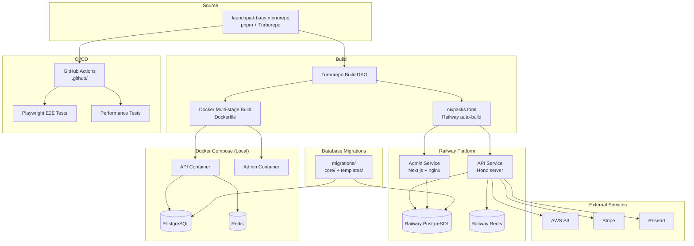

## Overview

How Launchpad BaaS is deployed — primary target is Railway with Docker as the containerization layer. Shows the multi-service deployment model with separate API and admin services.

## Diagram

## Notes

- Railway is primary deployment via nixpacks.toml auto-detection
- Docker multi-stage build available (Dockerfile.disabled suggests migration in progress)
- Admin service uses nginx with runtime env injection and security headers
- Two migration directories: core/ for platform tables, templates/ for template-specific tables
- Local development via docker-compose.yml (PostgreSQL + Redis)
- E2E tests via Playwright; performance testing infrastructure exists
- Makefile provides `make unified-run` for single-image deployment
- railway.json provides Railway-specific deployment configuration
- renovate.json manages automated dependency updates
