## Overview

High-level system architecture of Launchpad BaaS — a modular Backend-as-a-Service platform. The core monorepo hosts the Hono API server, Next.js admin UI, core SDKs, and 24 internal packages covering auth, database, payments, storage, email, AI, workflows, and more.

## Diagram

```mermaid
graph TD
    subgraph "Client Applications"
        WEBAPP[Web App<br/>React / Next.js]
        MOBILE[Mobile App<br/>React Native]
        AIAGENT[AI Agents<br/>via MCP Server]
    end

    subgraph "Launchpad BaaS Monorepo"
        subgraph "apps/"
            API["apps/api<br/>Hono API Server"]
            ADMIN["apps/admin<br/>Next.js Admin UI"]
        end

        subgraph "sdk/ (Core SDKs)"
            SDKCORE["sdk/core<br/>@launchpad/core"]
            SDKAUTH["sdk/auth<br/>@launchpad/auth"]
            SDKDB["sdk/db<br/>@launchpad/db"]
            SDKPAY["sdk/payments<br/>@launchpad/payments"]
        end

        subgraph "packages/ (24 internal)"
            PKG_AI["ai"]
            PKG_EMAIL["email"]
            PKG_STORAGE["storage"]
            PKG_WORKFLOWS["workflows"]
            PKG_SECRETS["secrets"]
            PKG_SCHEDULER["scheduler"]
            PKG_FUNCTIONS["functions"]
            PKG_EDGE["edge-functions-runtime"]
            PKG_METRICS["metrics, telemetry, logger"]
            PKG_SECURITY["security-scanner"]
            PKG_RESILIENCE["resilience, chaos, alerting"]
            PKG_SDKGEN["sdk-generator"]
            PKG_CLI["cli"]
            PKG_UI["ui"]
        end
    end

    subgraph "Infrastructure"
        PG[(PostgreSQL)]
        REDIS[(Redis)]
        S3[S3-compatible Storage]
    end

    subgraph "External Services"
        STRIPE[Stripe]
        RESEND[Resend Email]
        OPENAI[OpenAI / Anthropic]
    end

    subgraph "Deployment"
        RAILWAY[Railway]
        DOCKER[Docker]
    end

    WEBAPP -->|HTTP| API
    MOBILE -->|HTTP| API
    AIAGENT -->|MCP| API
    ADMIN --> API

    API --> SDKCORE
    API --> SDKAUTH
    API --> SDKDB
    API --> SDKPAY

    SDKAUTH -->|better-auth| PG
    SDKDB -->|Drizzle ORM| PG
    PKG_STORAGE --> S3
    PKG_EMAIL --> RESEND
    SDKPAY --> STRIPE
    PKG_AI --> OPENAI
    PKG_WORKFLOWS --> REDIS
    PKG_METRICS --> REDIS

    API --> RAILWAY
    ADMIN --> RAILWAY
    API --> DOCKER
```

## Notes

- All packages at v0.1.0 (pre-1.0, private, under active development)
- 24 internal packages cover: ai, alerting, backup, chaos, cli, dev-server, edge-functions-runtime, email, errors, functions, logger, metrics, payments, query-analyzer, resilience, scheduler, sdk-generator, secrets, security-scanner, storage, telemetry, template-manifest, ui, workflows
- Uses better-auth (org's own open-source library) for authentication
- Drizzle ORM for PostgreSQL with core and template-specific migrations
- Railway is the primary deployment target with Docker as alternative
- The sdk/ directory hosts SDKs that are also published independently as @launchpad/* packages
- launchpad-db-engine (public) provides the custom DB engine with multi-tenancy and 191 tests
