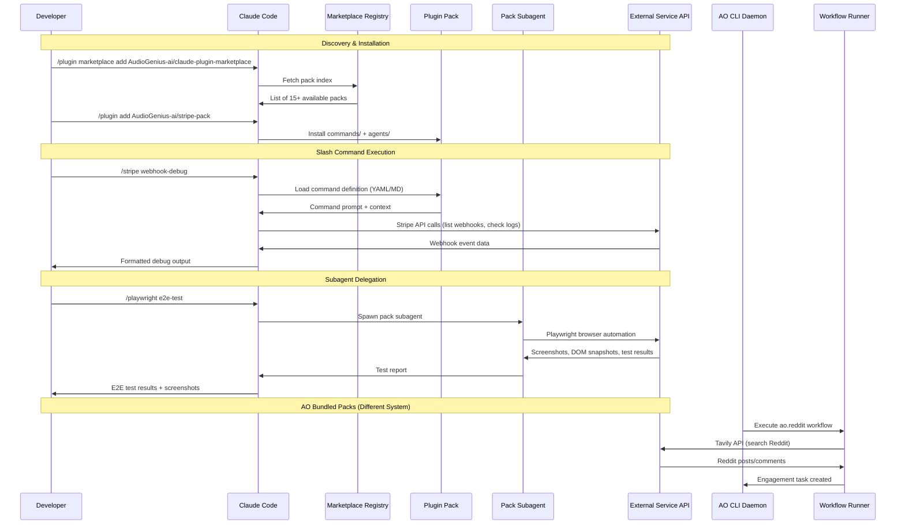

## Overview

How data flows through the Claude Code plugin pack ecosystem — from user invocation of slash commands, through the plugin system, to external service APIs. Also covers the ao-bundled-packs system which follows a different flow through AO's workflow engine.

## Diagram

## Notes

- Claude Code packs are YAML/Markdown definitions — no compiled code, just prompts and configs
- Each pack provides two types of extensions: slash commands (user-invoked) and subagents (delegated tasks)
- The marketplace acts as a discovery layer — packs are installed individually from GitHub repos
- Data flows: user → Claude Code → pack definition → Claude reasoning → external API → user
- ao-bundled-packs follow a completely different flow: AO daemon → workflow runner → external API
- Pack commands provide domain context to Claude but don't execute code themselves
- Subagents run as separate Claude processes with specific tool permissions
- research-pack supports multiple search backends: Tavily, Brave Search, Context7
