## Overview

Dependency relationships between the plugin packs, the marketplace registry, and the external services they connect to. Each pack is independent — they share no code dependencies but are discovered through the marketplace.

## Diagram

```mermaid
graph BT
    MKT["claude-plugin-marketplace<br/>Registry"]

    subgraph "Packs (15 independent)"
        SUPA["supabase-pack"]
        PG["postgres-pack"]
        FB["firebase-pack"]
        AWS["aws-pack"]
        DOCK["docker-pack"]
        MON["monitoring-pack"]
        PW["playwright-pack"]
        STRP["stripe-pack"]
        FIG["figma-pack"]
        RES["research-pack"]
        OLL["ollama-pack"]
        GWS["google-workspace-pack"]
        SLK["slack-pack"]
        LIN["linear-pack"]
        PDF["pdf-pack"]
    end

    subgraph "AO Extensions"
        AOSKILLS["ao-skills<br/>Claude Code plugin"]
        AOBUNDLE["ao-bundled-packs<br/>AO workflow packs"]
    end

    subgraph "External Service Dependencies"
        SUPA_API["Supabase API"]
        PG_API["PostgreSQL"]
        FB_API["Firebase/GCP"]
        AWS_API["AWS APIs"]
        DOCKER_API["Docker Engine"]
        GRAFANA["Grafana"]
        PW_API["Playwright/Chromium"]
        STRIPE_API["Stripe API"]
        FIGMA_API["Figma API"]
        TAVILY["Tavily / Brave / Context7"]
        OLLAMA_API["Ollama Local"]
        GOOGLE_API["Google Workspace API"]
        SLACK_API["Slack API"]
        LINEAR_API["Linear API"]
    end

    SUPA --> MKT
    PG --> MKT
    FB --> MKT
    AWS --> MKT
    DOCK --> MKT
    MON --> MKT
    PW --> MKT
    STRP --> MKT
    FIG --> MKT
    RES --> MKT
    OLL --> MKT
    GWS --> MKT
    SLK --> MKT
    LIN --> MKT
    PDF --> MKT
    AOSKILLS --> MKT

    SUPA --> SUPA_API
    PG --> PG_API
    FB --> FB_API
    AWS --> AWS_API
    DOCK --> DOCKER_API
    MON --> GRAFANA
    PW --> PW_API
    STRP --> STRIPE_API
    FIG --> FIGMA_API
    RES --> TAVILY
    OLL --> OLLAMA_API
    GWS --> GOOGLE_API
    SLK --> SLACK_API
    LIN --> LINEAR_API

    AOBUNDLE -.->|Depends on| AOSKILLS
    AOBUNDLE --> TAVILY

    style MKT fill:#f9e2af,stroke:#f5c211
    style AOSKILLS fill:#a6e3a1,stroke:#40a02b
    style AOBUNDLE fill:#a6e3a1,stroke:#40a02b
```

## Notes

- All packs are independent — no shared code dependencies between packs
- The marketplace is the only shared dependency (registry/discovery)
- Each pack wraps a specific external service API
- research-pack supports multiple backends: Tavily, Brave Search, Context7
- ao-bundled-packs use pack.toml format (different from Claude Code plugin format)
- ao.reddit pack requires TAVILY_API_KEY and optionally Playwright for browser automation
- Packs are YAML/Markdown-based — no compiled code, just command definitions and agent prompts
