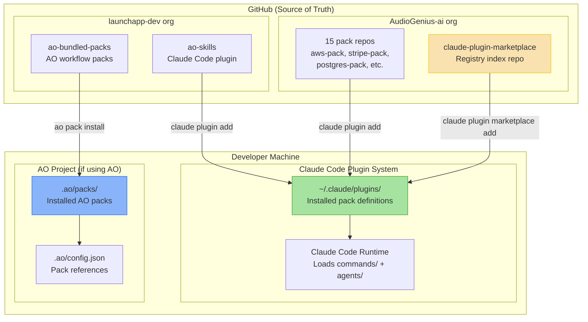

## Overview

How the plugin packs are deployed and distributed. Claude Code packs are GitHub-hosted YAML/Markdown repos installed via Claude Code's plugin system. AO bundled packs are distributed via pack.toml manifests installed into AO projects.

## Diagram

## Notes

- No build step, no compilation, no CI/CD — packs are raw YAML/Markdown installed directly from GitHub
- Two distinct distribution channels:
  - **Claude Code plugins**: installed via `claude plugin add` from GitHub repos
  - **AO bundled packs**: installed via `ao pack install` using pack.toml manifests
- The marketplace repo is a meta-package — installing it gives access to a discovery interface
- Packs are currently private (AudioGenius-ai org) but MIT-licensed (planned public release)
- Updates require re-running the plugin add command — no auto-update mechanism
- ao-skills bridges both systems: it's a Claude Code plugin that provides AO-specific slash commands
- No versioning system yet — packs track HEAD of their respective repos
- All 15 Claude Code packs were released in a coordinated batch on 2026-03-16/17
