## Overview

System architecture of the Claude Code plugin pack ecosystem. A marketplace registry indexes 15+ domain-specific packs, each providing slash commands and subagents. Separate from the AO bundled packs system which extends AO's workflow engine directly.

## Diagram

```mermaid
graph TD
    subgraph "Claude Code Runtime"
        CC["Claude Code<br/>AI coding assistant"]
        PLUGINS["Plugin System<br/>commands/ + agents/"]
    end

    subgraph "Marketplace"
        MKT["claude-plugin-marketplace<br/>Registry / Index"]
    end

    subgraph "Database Packs"
        SUPA["supabase-pack<br/>Auth, storage, edge fns"]
        PG["postgres-pack<br/>Schema, migrations, queries"]
        FB["firebase-pack<br/>Firestore, auth, functions"]
    end

    subgraph "Cloud & DevOps Packs"
        AWS["aws-pack<br/>S3, Lambda, EC2, CloudWatch"]
        DOCK["docker-pack<br/>Containers, compose"]
        MON["monitoring-pack<br/>Metrics, Grafana, alerts"]
    end

    subgraph "Development Packs"
        PW["playwright-pack<br/>E2E testing, screenshots"]
        STRP["stripe-pack<br/>Payments, webhooks"]
        FIG["figma-pack<br/>Design tokens, specs"]
        RES["research-pack<br/>Web search, docs, citations"]
        OLL["ollama-pack<br/>Local LLM inference"]
    end

    subgraph "Productivity Packs"
        GWS["google-workspace-pack<br/>Gmail, Calendar, Drive"]
        SLK["slack-pack<br/>Channels, standups"]
        LIN["linear-pack<br/>Issues, sprints, triage"]
        PDF["pdf-pack<br/>Generation, parsing, OCR"]
    end

    subgraph "AO-Specific"
        AOSKILLS["ao-skills<br/>AO slash commands"]
        AOBUNDLE["ao-bundled-packs<br/>AO workflow packs"]
    end

    CC --> PLUGINS
    PLUGINS --> MKT
    MKT --> SUPA
    MKT --> PG
    MKT --> FB
    MKT --> AWS
    MKT --> DOCK
    MKT --> MON
    MKT --> PW
    MKT --> STRP
    MKT --> FIG
    MKT --> RES
    MKT --> OLL
    MKT --> GWS
    MKT --> SLK
    MKT --> LIN
    MKT --> PDF
    MKT --> AOSKILLS

    AOBUNDLE -.->|Different system:<br/>pack.toml format| AOSKILLS

    subgraph "External APIs"
        TAVILY[Tavily API]
        BRAVE[Brave Search]
        CTX7[Context7]
    end

    RES --> TAVILY
    RES --> BRAVE
    RES --> CTX7
```

## Notes

- Two distinct pack systems: Claude Code plugins (commands/ + agents/) vs AO bundled packs (pack.toml)
- All Claude Code packs follow the same structure: commands/ for slash commands, agents/ for subagents
- The marketplace meta-pack acts as a discovery interface for browsing and installing packs
- All 15 Claude Code packs were released in a coordinated batch on 2026-03-16/17
- ao-skills bridges both systems: it's a Claude Code plugin that wraps AO CLI commands
- ao-bundled-packs extend AO's workflow system (e.g., ao.reddit for Reddit monitoring)
- Packs are MIT-licensed but currently private (likely going public)
