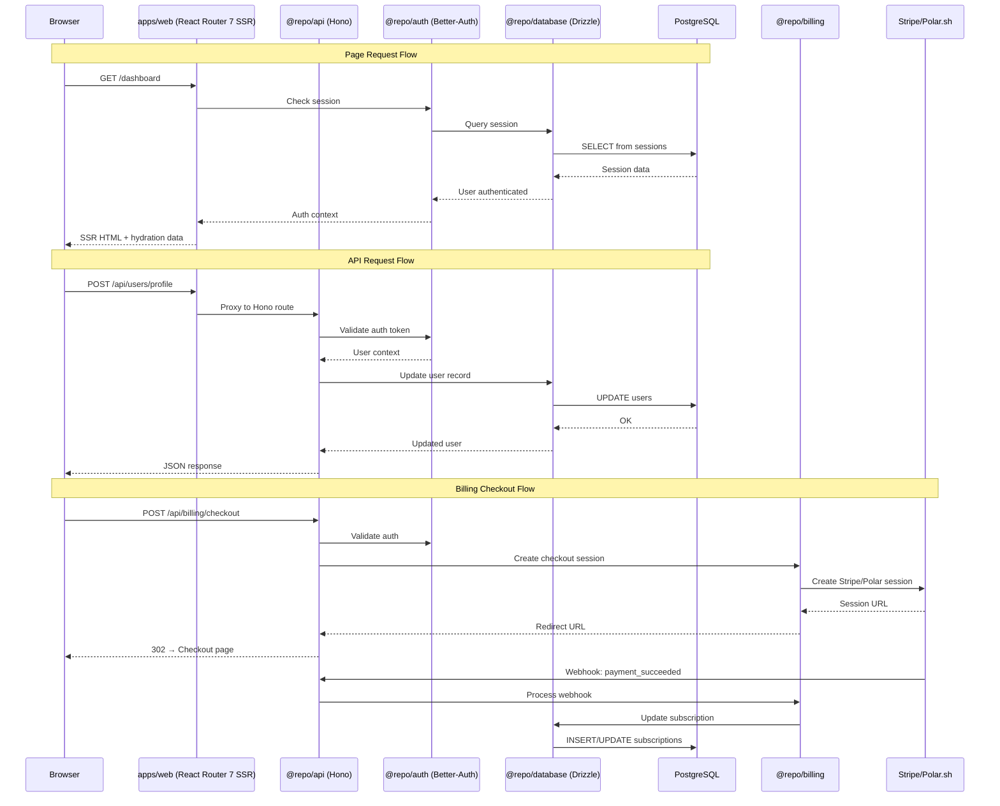

## Overview

How data moves through the SaaS template — from browser requests through SSR rendering, API routing, authentication, billing, and back. Covers the key flows: page rendering, API requests, auth, billing checkout, and file uploads.

## Diagram

## Notes

- React Router 7 SSR means the server renders full HTML on first load, then hydrates for SPA navigation
- The /api/* wildcard in apps/web proxies all API requests to the Hono server
- OpenAPI spec is generated from Zod schemas; @repo/api-hooks auto-generates typed React Query hooks from it
- File uploads use presigned S3 URLs — the API generates the URL, the browser uploads directly to S3
- PostHog analytics events fire client-side (posthog-js) and server-side (posthog-node)
