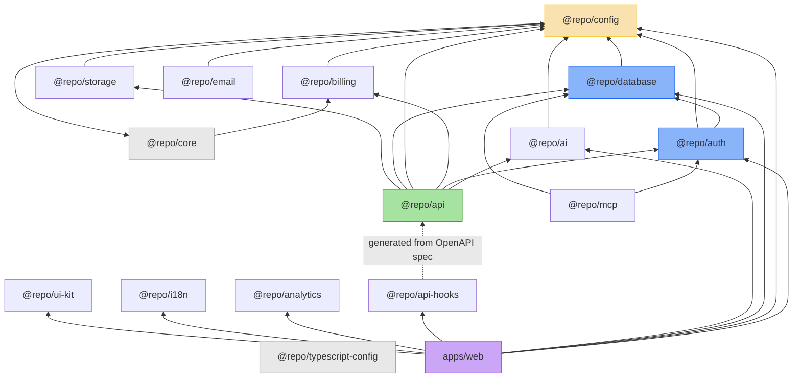

## Overview

Internal package dependency graph for the saas-template-launch-app-test monorepo. Shows how the 15 internal @repo/* packages depend on each other, forming a clear layered architecture from foundational config through domain packages to the web app.

## Diagram

## Notes

- @repo/typescript-config has no internal deps (leaf node shared by all packages)
- @repo/config is the central hub: most domain packages depend on it for Zod-validated env access
- @repo/api-hooks is auto-generated from the OpenAPI spec (dashed line = generated dependency)
- @repo/analytics, @repo/i18n, @repo/ui-kit are independent packages with no internal deps
- The dependency tree ensures Turborepo can parallelize builds effectively
- @repo/core provides lazy-init utilities consumed by config and billing
