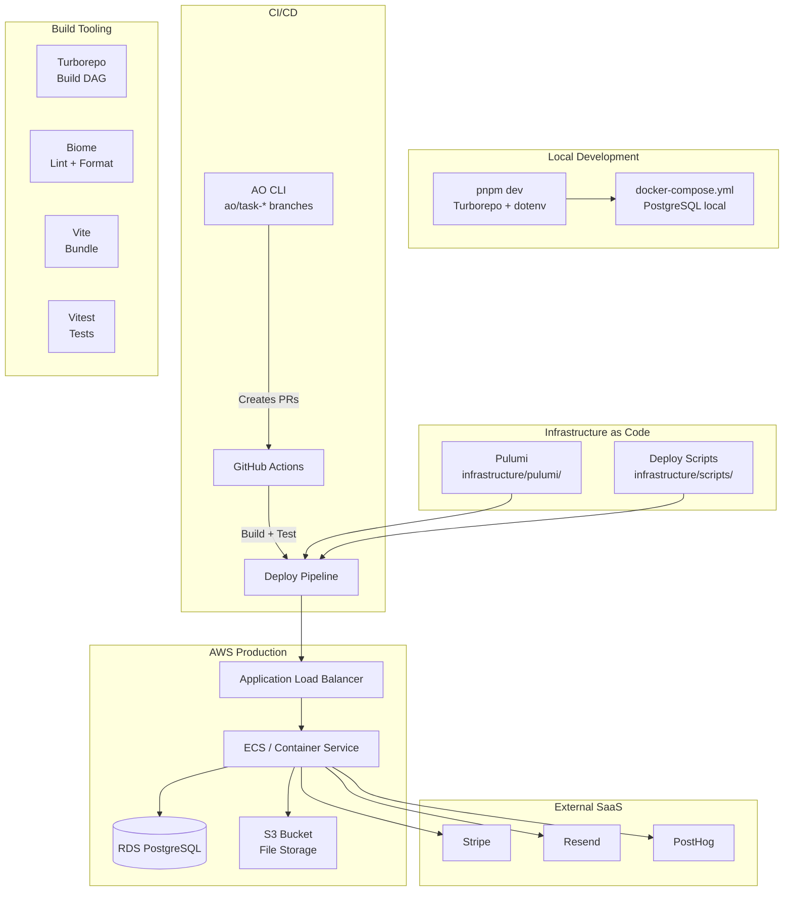

## Overview

How the SaaS template is deployed — local development with Docker Compose, production infrastructure via Pulumi on AWS, and CI/CD via GitHub Actions. The AO Agent Orchestrator automates PR creation and task execution.

## Diagram

## Notes

- Local dev uses Docker Compose for PostgreSQL; the app runs via `pnpm dev` with Turborepo
- Production IaC is Pulumi with @pulumi/aws and @pulumi/awsx packages
- Infrastructure scripts handle deploy, health checks, and secrets generation
- AO CLI automates feature development: creates ao/task-* branches and auto-merges PRs
- Turborepo handles the build DAG with proper env var cache invalidation via globalEnv
- docker-compose.prod.yml available for production-like local testing
