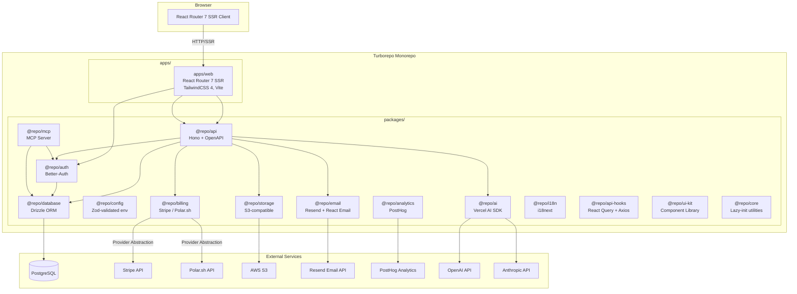

## Overview

High-level system architecture of the flagship SaaS template (launchapp-lite). Shows the Turborepo monorepo structure with apps/web as the SSR frontend, the Hono API server, and all external service integrations connected through provider abstractions.

## Diagram

## Notes

- The provider abstraction pattern allows swapping Stripe↔Polar.sh and OpenAI↔Anthropic via env vars
- All packages use lazy-init: config/db/auth initialized on first use, not at module load (critical for SSR)
- The API uses @hono/zod-openapi for spec generation; orval auto-generates @repo/api-hooks from the spec
- Internal packages use the @repo/* namespace convention
- Biome replaces ESLint+Prettier for linting/formatting
