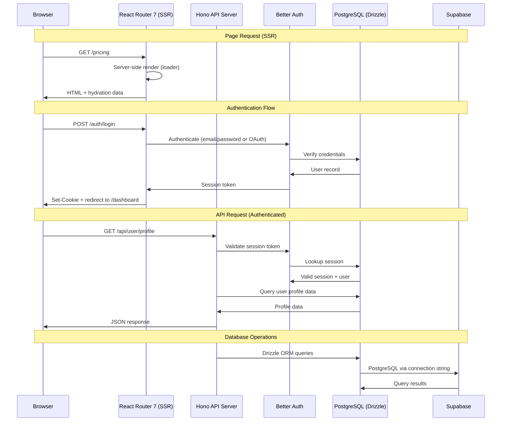

## Overview

Data flow through the shared website architecture. All three sites follow the same pattern: SSR-rendered React Router 7 pages, Hono API routes for backend logic, Better Auth for authentication, and Drizzle ORM for database access.

## Diagram

## Notes

- React Router 7 handles SSR — pages are rendered server-side with data loaders
- Hono serves as the API layer, proxied from /api/* routes
- Better Auth manages sessions and OAuth flows; session tokens stored in cookies
- Drizzle ORM provides type-safe database access to PostgreSQL
- Supabase is used as the managed PostgreSQL provider
- The sites are primarily content/marketing pages with auth-gated dashboard sections
- Static pages (/, /pricing, /faq, /terms) are SSR-rendered without database access
- Dashboard pages (/dashboard/*) require authentication and fetch data via API
