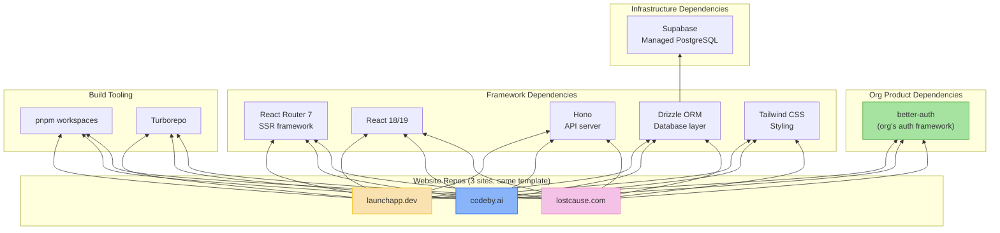

## Overview

Dependency graph for the Websites product line. All sites share the same template-based dependencies: React Router 7, Hono, Better Auth, Drizzle ORM, and Tailwind CSS. Shows both internal org dependencies and external package dependencies.

## Diagram

## Notes

- All three sites have identical dependency trees — they were scaffolded from the same template
- **better-auth** is the only internal org dependency — used for authentication in all sites
- Core framework stack: React Router 7 + Hono + Drizzle ORM + Tailwind CSS
- Supabase provides managed PostgreSQL — the only external infrastructure dependency
- pnpm + Turborepo for monorepo management (consistent with org-wide conventions)
- No shared UI kit dependency (each site has its own packages/ui)
- Zod is used for schema validation (via Drizzle and env config)
- Sites do not depend on the design-system package — they have inline UI components
