## Overview

Dependency graph for the Websites product line. launchapp-landing-v2 is a full platform monorepo with 16 packages and additional service dependencies. codeby.ai and lostcause.com share a simpler template.

## Diagram

```mermaid
graph BT
    subgraph "launchapp-landing-v2 (16 packages)"
        LV2["launchapp-landing-v2<br/>apps/web + apps/native"]
    end

    subgraph "Simpler Sites (shared template)"
        CODEBY["codeby.ai"]
        LOST["lostcause.com"]
    end

    subgraph "Org Product Dependencies"
        BA["better-auth<br/>(org's auth framework)"]
    end

    subgraph "Framework Dependencies"
        RR7["React Router 7<br/>SSR framework"]
        REACT["React 18/19"]
        HONO["Hono<br/>API server"]
        DRIZZLE["Drizzle ORM<br/>Database layer"]
        TW["Tailwind CSS<br/>Styling"]
        EXPO["React Native / Expo"]
    end

    subgraph "Service Dependencies (launchapp-landing-v2)"
        STRIPE["Stripe API"]
        RESEND["Resend Email"]
        MCP_SDK["@modelcontextprotocol/sdk"]
        FCM["FCM / APNs"]
    end

    subgraph "Infrastructure Dependencies"
        SUPA["Supabase<br/>Managed PostgreSQL"]
    end

    subgraph "Build Tooling"
        PNPM["pnpm workspaces"]
        TURBO["Turborepo"]
    end

    LV2 --> BA
    LV2 --> RR7
    LV2 --> HONO
    LV2 --> DRIZZLE
    LV2 --> TW
    LV2 --> REACT
    LV2 --> EXPO
    LV2 --> STRIPE
    LV2 --> RESEND
    LV2 --> MCP_SDK
    LV2 --> FCM

    CODEBY --> BA
    LOST --> BA
    CODEBY --> RR7
    CODEBY --> HONO
    CODEBY --> DRIZZLE
    CODEBY --> TW
    CODEBY --> REACT
    LOST --> RR7
    LOST --> HONO
    LOST --> DRIZZLE
    LOST --> TW
    LOST --> REACT

    DRIZZLE --> SUPA

    LV2 --> PNPM
    LV2 --> TURBO
    CODEBY --> PNPM
    CODEBY --> TURBO
    LOST --> PNPM
    LOST --> TURBO

    style BA fill:#a6e3a1,stroke:#40a02b
    style LV2 fill:#f9e2af,stroke:#f5c211
    style CODEBY fill:#89b4fa,stroke:#1e66f5
    style LOST fill:#f5c2e7,stroke:#ea76cb
```

## Notes

- launchapp-landing-v2 has 16 internal packages: api, auth, database, config, ai, payments, email, storage, analytics, i18n, push-notifications, appstores, api-hooks, ui-kit, eslint-config, typescript-config
- It also has apps/native (React Native/Expo), making it a cross-platform product, not just a website
- codeby.ai and lostcause.com use a simpler 4-package template (auth, database, ui, typescript-config)
- **better-auth** is used for authentication across all sites
- Supabase provides managed PostgreSQL
- pnpm + Turborepo for monorepo management
- Sites do not depend on the @audiogenius/design-system package — they have inline UI components
