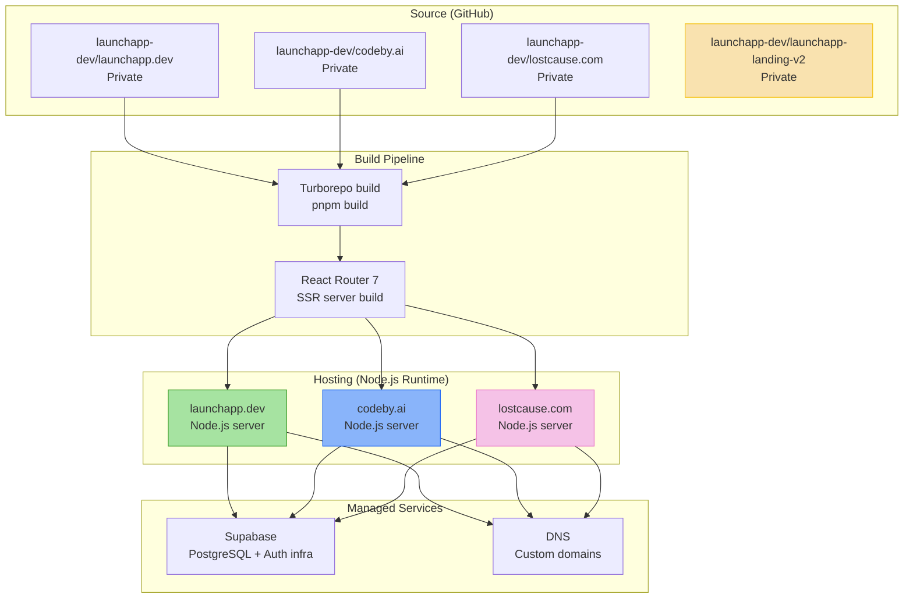

## Overview

Deployment architecture for the org's web properties. Sites use React Router 7 SSR which requires a Node.js server runtime. Supabase provides managed PostgreSQL. Exact hosting platforms are not specified in the repos.

## Diagram

## Notes

- All sites require a Node.js server runtime (React Router 7 SSR is not static)
- Exact hosting platform not visible in repos — likely Vercel, Railway, or similar Node.js host
- All repos are private
- Supabase provides managed PostgreSQL for all sites
- launchapp-landing-v2 is the actively developed landing page (updated 2026-01)
- codeby.ai (last updated 2025-10) and lostcause.com (last updated 2025-09) are in maintenance mode
- No visible CI/CD configuration (GitHub Actions) in the repos
- Docker support possible via the template but not confirmed in use
- Each site likely has its own Supabase project (separate databases)
