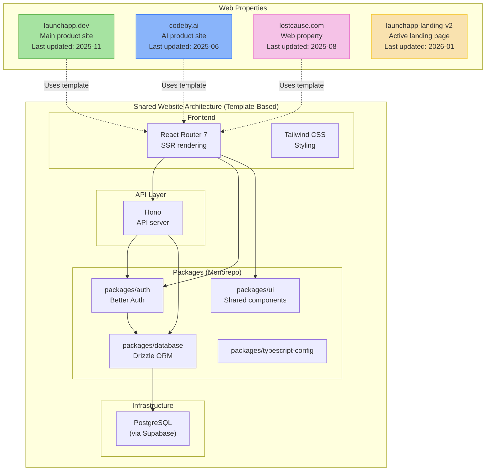

## Overview

System architecture of the org's web properties. All three main sites (launchapp.dev, codeby.ai, lostcause.com) share the same monorepo template structure — React Router 7 SSR frontend with Hono API backend, Drizzle ORM, and Supabase/PostgreSQL. The launchapp-landing-v2 is the current active landing page development.

## Diagram

## Notes

- All three main sites were scaffolded from the same monorepo template (launchapp-lite pattern)
- launchapp.dev is the main product website but appears outdated (last updated 2025-11)
- launchapp-landing-v2 (updated 2026-01) is the active landing page under development
- codeby.ai and lostcause.com are in maintenance mode with no recent updates
- Shared stack: React Router 7 + Hono + Better Auth + Drizzle ORM + Tailwind CSS
- pnpm workspaces + Turborepo for monorepo management
- Several legacy/abandoned landing pages exist: launchapp.dev-landing, aethris-landing, site-inspector-landing
- mymoku.net is a separate web app with recent activity (2026-03)
