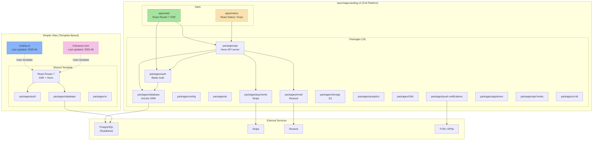

## Overview

System architecture of the org's web properties. launchapp-landing-v2 is the most complex — a full-featured platform monorepo with 16 packages, web + native apps, payments, push notifications, and MCP integration. The other sites (codeby.ai, lostcause.com) use a simpler shared template.

## Diagram

## Notes

- launchapp-landing-v2 is a full platform (not a simple landing page) with 16 packages + web + native apps
- It includes payments, push notifications, appstores, analytics, i18n, AI, and MCP integration
- pnpm 10.11.0 + Turborepo for monorepo management
- codeby.ai and lostcause.com use a simpler 4-package template
- launchapp.dev (last updated 2025-11) and legacy landing pages are in maintenance mode
- mymoku.net is a separate web app with recent activity (2026-03)
